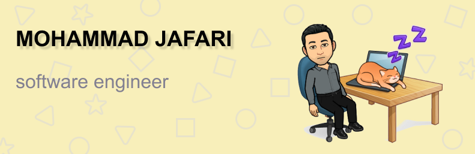

# Hi, I'm Mohammad 👋🏻.

## About Me
I hold a Master's degree in Software Engineering from Imam Reza International University and a Bachelor's degree in Computer Engineering from University of Bojnurd. My journey in software development has been fueled by a passion for creating efficient and elegant solutions, particularly in the realm of web development and programming frameworks.

Currently, I'm working extensively with Python and Vue.js, diving deeper into modern front-end and back-end development practices. My GitHub repositories showcase a mix of academic projects, exercises, and real-world projects aimed at honing my technical skills.

## Skills in Front End

* 💻 HTML, CSS, JavaScript, jQuery
* 🎨🖌️ Bootstrap, Sass
* 🔧 Vue.js (including Composition API)

## Back End Familiar with

* 🛠️ PHP, Ajax, MYSQL, SQL Server
* 🔧 Python (Flask)

## Badge

### GitHub Stats

### Wakatime

## Social

  

<a href="https://iconscout.com/icons/instagram" target="_blank">Instagram Icon</a> by <a href="https://iconscout.com/contributors/juraj-sedlak">Juraj Sedlák</a> on <a href="https://iconscout.com">IconScout</a> 
<a href="https://iconscout.com/icons/play" target="_blank">Play Icon</a> by <a href="https://iconscout.com/contributors/roundicons-com">Roundicons.com</a> on <a href="https://iconscout.com">IconScout</a>
    
